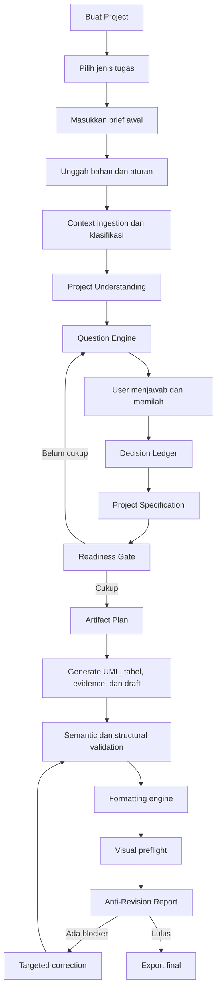
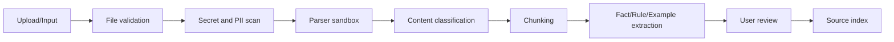
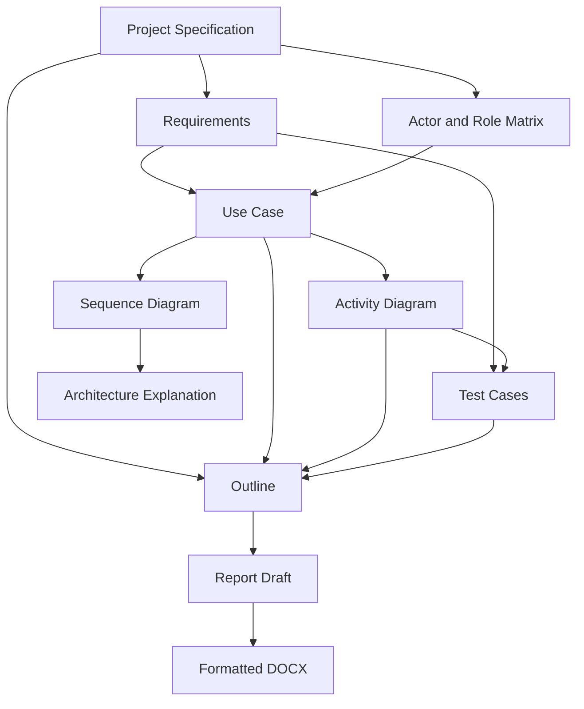
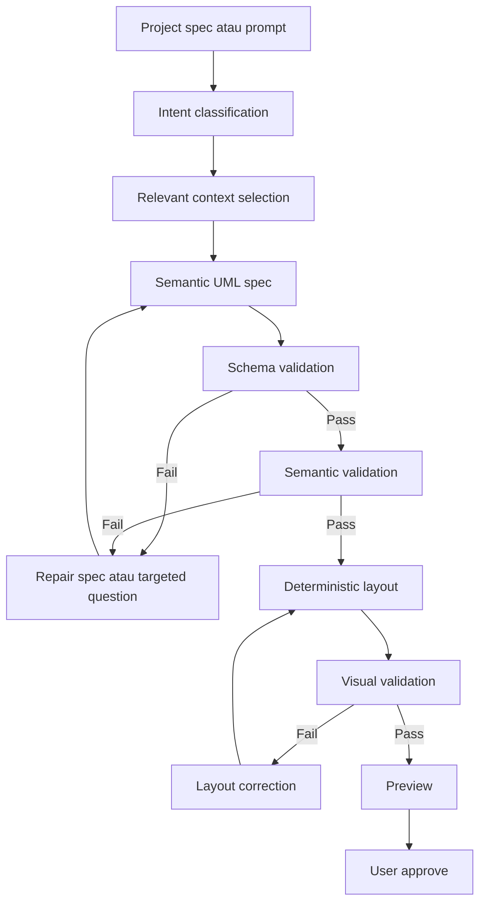
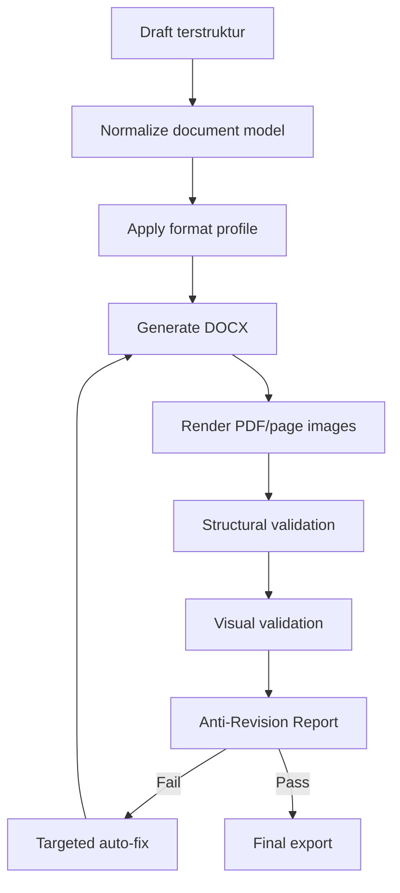
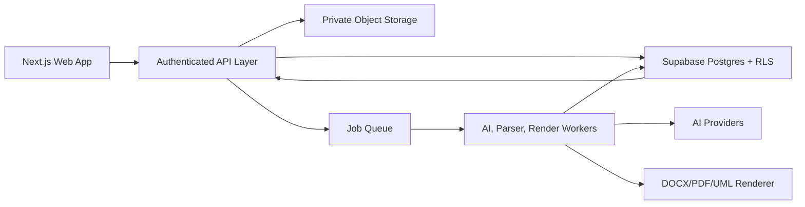

# KeluhKampus Research Studio — Product & Technical Blueprint

Versi: 1.0  
Tanggal: 2026-07-26  
Status: Dokumen arah produk dan rancangan implementasi  
Nama kerja produk: **KeluhKampus Research Studio**  

Dokumen ini menjadi acuan utama untuk mengembangkan KeluhKampus dari kumpulan tools AI menjadi sistem penyelesaian tugas akademik dan proyek mahasiswa yang terstruktur, konsisten, dapat divalidasi, dan mengurangi revisi.

---

## 1. Ringkasan produk

### 1.1 Product thesis

KeluhKampus tidak perlu mengalahkan ChatGPT dalam kualitas percakapan atau kemampuan menulis secara umum. Produk ini harus unggul pada hal yang sulit dilakukan oleh chatbot general-purpose:

- membangun konteks proyek secara bertahap;
- memandu user menjawab kebutuhan yang belum lengkap;
- mencatat dan mengunci keputusan;
- menjaga konsistensi antara laporan, diagram, tabel, requirement, dan source code;
- menerapkan aturan format secara deterministik;
- memvalidasi output sebelum dianggap selesai;
- menunjukkan bagian yang masih berisiko direvisi dosen;
- menghasilkan artefak siap pakai, bukan sekadar respons chat.

### 1.2 Definisi produk

> KeluhKampus Research Studio adalah workspace berbasis AI yang membantu mahasiswa mengubah brief, aturan dosen, pedoman kampus, source code, data mentah, referensi, dan contoh laporan menjadi artefak akademik yang konsisten, tervalidasi, dan siap diserahkan.

### 1.3 Janji utama kepada user

> Masukkan seluruh bahan yang kamu punya. Sistem akan membantu memilahnya, menanyakan bagian yang belum jelas, mengunci keputusan penting, membuat laporan dan UML yang konsisten, lalu memeriksa format serta potensi revisi sebelum kamu submit.

### 1.4 Posisi terhadap ChatGPT

| Dimensi | Chatbot general-purpose | KeluhKampus Research Studio |
|---|---|---|
| Input | Satu prompt atau percakapan | Brief, file, aturan, contoh, source code, feedback dosen, dan jawaban terstruktur |
| Konteks | Bergantung pada history chat | Project workspace permanen dan versioned |
| Pertanyaan | Tergantung prompt user | Question engine yang mencari informasi paling kritis |
| Keputusan | Tersebar di percakapan | Decision ledger dengan status draft/confirmed/locked |
| Output | Teks atau gambar per respons | Artefak project yang saling terhubung |
| UML | Sering langsung digambar | Schema-first, divalidasi, lalu dirender deterministik |
| Format dokumen | Instruksi natural language | Rule engine DOCX + visual preflight |
| Revisi | User meminta revisi satu per satu | Sistem mendeteksi konflik dan kekurangan sebelum generate final |
| Konsistensi | Mudah berubah antar-respons | Dependency graph dan impact analysis |
| Sumber | Bisa tidak terlacak | Claim-to-evidence traceability |

### 1.5 North-star outcome

User dapat menyelesaikan tugas akademik dengan:

- lebih sedikit putaran revisi;
- lebih sedikit bagian yang bertentangan;
- diagram yang logis dan dapat dibaca;
- format yang mengikuti aturan kampus/dosen;
- sumber yang dapat ditelusuri;
- proses yang tetap mudah walaupun input awalnya berantakan.

---

## 2. Masalah utama yang diselesaikan

### 2.1 Masalah user

Mahasiswa jarang memiliki satu prompt yang lengkap. Informasi proyek biasanya tersebar dalam:

- chat dosen;
- PDF pedoman;
- template DOCX;
- source code;
- screenshot aplikasi;
- database/schema;
- catatan kasar;
- laporan senior;
- artikel jurnal;
- revisi dosen sebelumnya;
- ingatan user yang baru muncul setelah ditanya.

Chatbot biasa memaksa user merangkum semua itu menjadi prompt. Jika prompt kurang lengkap, output tampak meyakinkan tetapi sering:

- salah format;
- tidak konsisten;
- diagramnya tidak logis;
- mengarang detail;
- bertentangan dengan source code;
- tidak mengikuti request dosen;
- memiliki sitasi yang tidak mendukung klaim;
- harus direvisi berkali-kali.

### 2.2 Root cause revisi

Revisi bukan hanya terjadi karena isi tulisan buruk. Penyebabnya dapat dipetakan menjadi:

1. **Information gap** — data penting belum ditanyakan.
2. **Constraint gap** — aturan dosen/kampus belum diterjemahkan menjadi rule.
3. **Consistency gap** — requirement, UML, tabel, dan laporan berbeda.
4. **Evidence gap** — klaim tidak punya sumber atau sumber tidak relevan.
5. **Formatting gap** — struktur DOCX tidak sesuai pedoman.
6. **Logic gap** — flow UML memiliki node/cabang yang salah.
7. **Change propagation gap** — perubahan satu bagian tidak diterapkan ke bagian lain.
8. **Validation gap** — output langsung diberikan tanpa quality gate.

### 2.3 Job to be done

> Ketika saya mendapat tugas atau proyek dari dosen dan bahan yang saya miliki masih tersebar, bantu saya menyatukan semua konteks, menunjukkan apa yang belum jelas, menyusun output yang konsisten, dan memeriksanya sebelum saya serahkan agar saya tidak bolak-balik revisi.

---

## 3. Target user dan use case

### 3.1 Persona utama

#### A. Mahasiswa proyek software

Memiliki source code/aplikasi, tetapi kesulitan mengubahnya menjadi:

- kebutuhan fungsional;
- use case;
- activity diagram;
- sequence diagram;
- penjelasan arsitektur;
- BAB metode dan implementasi;
- test case;
- dokumentasi final.

#### B. Mahasiswa skripsi/proposal

Memiliki topik awal, tetapi membutuhkan:

- pemetaan masalah;
- pencarian referensi;
- evidence extraction;
- research gap;
- novelty;
- outline;
- konsistensi sitasi;
- format sesuai kampus.

#### C. Mahasiswa tugas laporan/makalah

Memiliki deadline pendek dan instruksi dosen yang spesifik. Membutuhkan workflow yang lebih ringan:

- masukkan instruksi;
- unggah bahan;
- jawab pertanyaan minimum;
- generate;
- preflight;
- export.

### 3.2 Persona sekunder

- Dosen pembimbing yang ingin memberi review terstruktur.
- Tim capstone yang membutuhkan satu source of truth.
- Admin program studi yang ingin membuat template/rubrik institusi.

### 3.3 Use case prioritas

1. Membuat laporan proyek dari source code dan pedoman dosen.
2. Membuat UML yang benar dari requirement atau source code.
3. Memformat DOCX agar mengikuti template kampus.
4. Memeriksa kesiapan dokumen sebelum submit.
5. Menyusun proposal/skripsi berbasis evidence.
6. Menerapkan feedback dosen ke semua artefak yang terdampak.

---

## 4. Prinsip desain produk

### 4.1 Ask before generate

Sistem tidak menghasilkan artefak final sebelum informasi kritis cukup atau user secara sadar menerima risikonya.

### 4.2 Specification before presentation

AI menghasilkan struktur/spec terlebih dahulu. Renderer deterministik menghasilkan tampilan akhir.

### 4.3 One project, one source of truth

Semua output berasal dari `Project Specification` yang sama. Jangan membangun laporan dan diagram dari prompt terpisah yang tidak saling mengetahui.

### 4.4 Confirmed facts are not silently changed

Keputusan yang sudah dikonfirmasi user tidak boleh diubah model tanpa approval.

### 4.5 Every important output is validated

Tidak ada status “final” hanya karena AI selesai merespons. Status final membutuhkan quality gate.

### 4.6 AI handles ambiguity; code handles rules

- AI: memahami bahasa, mengklasifikasi, merangkum, mengajukan pertanyaan, dan menyusun draft.
- Code/rule engine: format, numbering, graph validation, schema validation, permission, dependency, dan export.

### 4.7 Show uncertainty

Sistem harus membedakan:

- fakta dari source;
- jawaban user;
- aturan dosen;
- inference AI;
- placeholder;
- informasi yang belum diketahui.

### 4.8 Changes must have visible impact

Setiap perubahan penting harus menunjukkan artefak apa yang terdampak sebelum diterapkan.

### 4.9 Login, usage limits, dan premium

Fitur ini disiapkan sebagai extension point, bukan default activation.

- Login dipakai untuk identitas project, quota, dan sinkronisasi multi-perangkat.
- Usage limit membatasi generate, revisi, upload, dan polling job per user atau per project.
- Premium dapat menaikkan quota, membuka fitur batch/advanced, atau memberi prioritas queue.
- Enforcement harus terjadi di server, bukan hanya di client.
- State sensitif harus dikaitkan ke owner project dan audit log.
- Jika fitur ini belum aktif, UI boleh menampilkan entry point pasif, tetapi tidak boleh membuka bypass penggunaan tanpa kontrol.

---

## 5. Non-goals awal

Untuk menjaga fokus, versi awal bukan:

- chatbot general-purpose;
- mesin plagiarisme penuh;
- pengganti dosen pembimbing;
- marketplace jurnal;
- learning management system;
- project management tool lengkap;
- editor desain diagram bebas setingkat Figma;
- generator skripsi otomatis tanpa keterlibatan user.

Fitur tracker, mini AI tools, dan template generik hanya dipertahankan jika terhubung ke project workflow utama.

---

## 6. Alur produk end-to-end



### 6.1 Tahap 1 — Create project

User memilih tipe project:

- laporan proyek software;
- proposal/skripsi;
- makalah;
- laporan praktikum;
- capstone;
- dokumentasi teknis;
- custom.

Pilihan ini mengaktifkan workflow, pertanyaan, validator, dan artefak yang relevan.

### 6.2 Tahap 2 — Context collection

User dapat:

- mengetik ide;
- menjawab form singkat;
- mengunggah file;
- menempel feedback dosen;
- menghubungkan repository;
- menambahkan referensi;
- menandai contoh laporan sebagai contoh struktur, bukan sumber fakta.

### 6.3 Tahap 3 — Understanding dan clarification

Sistem menampilkan pemahaman sementaranya dan daftar informasi yang belum jelas. User dapat:

- menerima;
- mengubah;
- menolak;
- menandai “belum tahu”;
- meminta AI memberi rekomendasi.

### 6.4 Tahap 4 — Specification lock

Setelah pertanyaan kritis terjawab, sistem membuat Project Specification. User menyetujui bagian penting sebelum generate artefak mahal.

### 6.5 Tahap 5 — Artifact production

Sistem membuat artefak sesuai dependency order. Contoh:

1. requirement;
2. actor/role matrix;
3. use case spec;
4. activity/sequence spec;
5. test case;
6. outline;
7. draft;
8. formatted DOCX.

### 6.6 Tahap 6 — Preflight dan export

Semua artefak diperiksa. User mendapat readiness score dan blocker yang spesifik sebelum export.

---

## 7. Project lifecycle dan state machine

### 7.1 State project

```text
draft
collecting_context
needs_clarification
spec_review
ready_to_generate
generating
needs_correction
ready_for_preflight
preflight_failed
ready_to_export
exported
archived
```

### 7.2 Aturan transisi

- `draft → collecting_context`: project memiliki title/working topic.
- `collecting_context → needs_clarification`: minimal satu source berhasil diproses.
- `needs_clarification → spec_review`: semua pertanyaan blocker dijawab atau di-waive user.
- `spec_review → ready_to_generate`: field wajib dikonfirmasi.
- `ready_to_generate → generating`: job dibuat dengan snapshot spec.
- `generating → needs_correction`: validator menemukan error.
- `generating → ready_for_preflight`: artefak selesai dan semantic validation lulus.
- `ready_for_preflight → preflight_failed`: format/visual validation gagal.
- `ready_for_preflight → ready_to_export`: seluruh blocker lulus.
- `ready_to_export → exported`: file final berhasil dibuat dan hash dicatat.

### 7.3 Waiver

User boleh melanjutkan meskipun ada informasi belum lengkap, tetapi harus memilih alasan:

- data belum tersedia;
- akan dilengkapi manual;
- tidak relevan;
- mengikuti instruksi dosen;
- menerima placeholder.

Waiver disimpan agar sistem tidak terus menanyakan hal yang sama.

---

## 8. Information architecture dan layar utama

### 8.1 Global navigation

- Home/Projects
- New Project
- Templates & Rules
- Account & Plan
- Admin/Institution jika tersedia

### 8.2 Project workspace navigation

1. Overview
2. Sources
3. Understanding
4. Questions
5. Decisions
6. Specification
7. Research & Evidence
8. Artifacts
   - Requirements
   - UML
   - Tables
   - Test Cases
   - Outline
   - Draft
9. Format & Preflight
10. Revisions
11. Export
12. Activity/History

### 8.3 Overview

Overview harus menjawab:

- Apa tujuan project?
- Apa yang sudah lengkap?
- Apa yang masih kurang?
- Apa artefak berikutnya?
- Apa blocker terbesar?
- Apa perubahan terakhir?
- Berapa readiness score?

### 8.4 Action center

Dashboard project tidak menampilkan terlalu banyak tombol. Tampilkan satu primary action berdasarkan state:

- “Tambahkan pedoman dosen”
- “Jawab 4 pertanyaan penting”
- “Review Project Specification”
- “Perbaiki cabang UML yang belum valid”
- “Jalankan preflight format”
- “Export dokumen final”

---

## 9. Context ingestion pipeline

### 9.1 Jenis source

```text
brief
lecturer_instruction
campus_guideline
docx_template
example_report
source_code
database_schema
research_paper
raw_data
interview_transcript
survey_data
revision_note
image_or_screenshot
manual_note
```

### 9.2 Pipeline



### 9.3 File validation

Sebelum parsing:

- cek user/project authorization;
- cek file size;
- cek extension;
- cek MIME;
- cek magic bytes;
- cek archive nesting;
- cek total uncompressed size;
- blok `.env`, credentials, private key, token, dan file sistem sensitif;
- beri warning untuk file yang mungkin mengandung PII.

### 9.4 Content classification

Setiap potongan content diklasifikasikan sebagai:

- `fact` — fakta project;
- `requirement` — kebutuhan sistem;
- `constraint` — batasan;
- `format_rule` — aturan format;
- `lecturer_request` — request dosen;
- `example_pattern` — pola dari contoh;
- `evidence` — dukungan referensi;
- `feedback` — revisi/koreksi;
- `unknown` — perlu review.

### 9.5 Source authority

Prioritas default jika terjadi konflik:

1. request dosen terbaru;
2. pedoman resmi kampus/fakultas;
3. template resmi;
4. keputusan user terkonfirmasi;
5. source code/database aktual;
6. brief awal;
7. contoh laporan;
8. inference AI.

Prioritas dapat diubah user. Sistem tidak boleh menyelesaikan konflik penting secara diam-diam.

### 9.6 Source citation internal

Setiap extracted item menyimpan:

- source ID;
- file name;
- page/section/line jika tersedia;
- text span;
- extraction confidence;
- user confirmation status;
- parser/model version.

---

## 10. Project Understanding

### 10.1 Tujuan

Project Understanding adalah ringkasan terstruktur yang menjawab “apa yang sistem pahami saat ini?” sebelum artefak dibuat.

### 10.2 Struktur

```json
{
  "projectType": "software-report",
  "title": "Sistem Pengaduan Mahasiswa Berbasis Web",
  "objective": "Membangun sistem pengaduan yang dapat dilacak",
  "problem": "Pengaduan saat ini tersebar dan tidak transparan",
  "actors": ["Mahasiswa", "Admin", "Dosen"],
  "scope": ["pengajuan", "verifikasi", "status", "notifikasi"],
  "outOfScope": ["pembayaran", "chat realtime"],
  "constraints": ["menggunakan Supabase", "format kampus 2026"],
  "lecturerRequests": ["activity diagram wajib di BAB 3"],
  "knownFacts": [],
  "assumptions": [],
  "conflicts": [],
  "missingInformation": []
}
```

### 10.3 Review UI

Tampilkan dalam card:

- Confirmed
- Needs confirmation
- Conflict
- Missing
- AI suggestion

Setiap item memiliki action: accept, edit, reject, mark unknown, atau attach source.

---

## 11. Question Engine

### 11.1 Tujuan

Question Engine mengurangi revisi dengan menanyakan informasi yang paling memengaruhi artefak sebelum generation.

### 11.2 Jenis pertanyaan

- fakta project;
- scope;
- aktor dan permission;
- alur normal;
- alur error/exception;
- metode penelitian;
- kebutuhan data;
- format kampus;
- aturan sitasi;
- request dosen;
- konflik antar-source;
- pilihan implementasi;
- approval terhadap inference AI.

### 11.3 Priority scoring

Setiap pertanyaan diberi skor:

```text
priority = impact × uncertainty × artifact_count × revision_risk
```

Keterangan:

- `impact`: seberapa besar jawaban mengubah output;
- `uncertainty`: seberapa tidak yakin sistem;
- `artifact_count`: jumlah artefak yang bergantung;
- `revision_risk`: probabilitas menjadi koreksi dosen.

### 11.4 Question levels

- **Blocker**: wajib dijawab sebelum generate.
- **Important**: sangat disarankan.
- **Optional**: meningkatkan kualitas.
- **Deferred**: boleh dijawab nanti.

### 11.5 Bentuk pertanyaan

Gunakan format paling ringan:

- pilihan tunggal;
- multi-select;
- yes/no;
- urutkan prioritas;
- pilih dari source;
- teks pendek;
- teks panjang hanya jika memang perlu.

### 11.6 Struktur data pertanyaan

```json
{
  "id": "q_auth_failure",
  "category": "exception-flow",
  "question": "Jika login gagal, apa yang terjadi?",
  "reason": "Jawaban menentukan cabang activity diagram dan test case.",
  "level": "blocker",
  "answerType": "single-choice",
  "options": [
    "Kembali ke form login",
    "Akun dikunci setelah beberapa percobaan",
    "Admin harus membuka akun"
  ],
  "affectedArtifacts": ["activity-login", "test-login", "bab-3"],
  "sourceRefs": [],
  "status": "unanswered"
}
```

### 11.7 Aturan kualitas question engine

- Jangan menanyakan informasi yang sudah ada di source terkonfirmasi.
- Jangan menanyakan lebih dari 3–5 pertanyaan dalam satu batch.
- Jelaskan dampak pertanyaan.
- Simpan “belum tahu” sebagai jawaban valid.
- Jika user tidak tahu, tawarkan rekomendasi dengan trade-off.
- Jangan mengubah rekomendasi menjadi fakta sampai user menerima.
- Pertanyaan lanjutan hanya muncul jika jawaban sebelumnya memang memerlukannya.

### 11.8 Completion condition

Question phase selesai ketika:

- semua blocker answered/waived;
- tidak ada conflict unresolved yang memengaruhi artefak wajib;
- readiness minimum tercapai;
- user menyetujui Project Specification.

---

## 12. Decision Ledger

### 12.1 Tujuan

Decision Ledger adalah catatan keputusan resmi project agar AI tidak berubah-ubah antar-generation.

### 12.2 Struktur keputusan

```json
{
  "id": "decision_admin_verify",
  "type": "actor-permission",
  "statement": "Admin dapat memverifikasi dan mengubah status pengaduan.",
  "value": {
    "actor": "Admin",
    "actions": ["verify", "change-status"]
  },
  "status": "locked",
  "origin": "user-answer",
  "sourceRefs": ["q_admin_role"],
  "affectedArtifacts": ["usecase-main", "activity-complaint", "rbac-table", "bab-3"],
  "createdAt": "...",
  "confirmedAt": "...",
  "version": 2
}
```

### 12.3 Status

- `suggested`: usulan AI;
- `draft`: diedit tetapi belum dikonfirmasi;
- `confirmed`: diterima user;
- `locked`: menjadi source of truth;
- `superseded`: diganti keputusan baru;
- `rejected`: tidak digunakan.

### 12.4 Aturan perubahan

Jika keputusan locked diubah:

1. sistem membuat versi baru;
2. sistem menghitung impact;
3. user melihat artefak terdampak;
4. user memilih regenerate semua atau sebagian;
5. artefak lama diberi status stale;
6. audit trail tidak dihapus.

---

## 13. Project Specification

### 13.1 Fungsi

Project Specification adalah source of truth yang dipakai semua generator dan validator.

### 13.2 Bagian untuk proyek software

- identity dan objective;
- problem statement;
- scope/out-of-scope;
- actor dan role;
- functional requirement;
- non-functional requirement;
- business rules;
- entities/data model;
- primary flows;
- exception flows;
- external systems;
- technology constraints;
- test strategy;
- lecturer/campus constraints;
- required artifacts;
- formatting profile.

### 13.3 Bagian untuk skripsi/proposal

- topic/title;
- background facts;
- problem statement;
- research questions;
- objectives;
- scope;
- methodology;
- population/sample/data;
- variables/themes;
- prior work;
- evidence;
- gap;
- novelty;
- limitations;
- required chapters;
- citation rules;
- formatting profile.

### 13.4 Snapshot

Setiap generation job memakai immutable specification snapshot. Jika spec berubah saat job berjalan, hasil job tetap ditautkan ke versi lama dan diberi warning jika sudah stale.

---

## 14. Artifact graph dan cross-artifact consistency

### 14.1 Konsep

Setiap artefak adalah node. Dependency adalah edge.



### 14.2 Artifact status

```text
planned
generating
draft
needs_review
approved
stale
validation_failed
ready
exported
```

### 14.3 Stale detection

Jika dependency version berubah, artefak downstream menjadi `stale`. Contoh:

- Actor berubah → use case, activity, sequence, RBAC table, test case, dan BAB terkait stale.
- Format profile berubah → DOCX stale, tetapi isi draft tidak perlu regenerate.
- Referensi diganti → citation map dan bagian laporan terkait stale.

### 14.4 Impact preview

Sebelum perubahan diterapkan:

```text
Perubahan:
Role Dosen sekarang dapat memberi keputusan akhir.

Dampak:
- Use Case Utama: regenerate
- Activity Pengaduan: regenerate
- Sequence Verifikasi: regenerate
- Tabel Hak Akses: update
- BAB 3.2: review
- Test Case TC-08: create
```

### 14.5 Partial regeneration

Regeneration tidak boleh selalu mengulang seluruh project. Sistem hanya memperbarui artefak terdampak dan mempertahankan bagian manual user.

---

## 15. Research evidence dan citation system

### 15.1 Tujuan

Menjamin bahwa klaim akademik dapat ditelusuri ke evidence, bukan sekadar daftar referensi.

### 15.2 Evidence structure

```json
{
  "referenceId": "doi:...",
  "claimType": "finding",
  "summary": "...",
  "method": "...",
  "result": "...",
  "limitation": "...",
  "quote": "...",
  "page": 7,
  "confidence": 0.91,
  "verifiedByUser": false
}
```

### 15.3 Claim structure

```json
{
  "id": "claim_bab2_04",
  "text": "Sistem pengaduan digital meningkatkan keterlacakan proses.",
  "type": "academic-claim",
  "supportingEvidenceIds": ["ev_21", "ev_34"],
  "status": "supported",
  "strength": "medium",
  "warnings": []
}
```

### 15.4 Claim status

- `supported`;
- `partially_supported`;
- `unsupported`;
- `contradicted`;
- `common_knowledge`;
- `user_data`;
- `placeholder`.

### 15.5 Citation preflight

Periksa:

- citation ada di bibliography;
- bibliography dipakai di body;
- tahun/author konsisten;
- DOI canonical;
- evidence mendukung klaim;
- tidak ada referensi fabricated;
- format sesuai style;
- kutipan langsung punya halaman jika tersedia.

---

## 16. UML Engine — rancangan inti

### 16.1 Tujuan

Menghasilkan diagram yang benar secara logika, konsisten dengan project, stabil saat diedit, dan dapat dirender ulang tanpa berubah secara acak.

### 16.2 Prinsip UML engine

1. Requirement/spec menjadi input utama.
2. AI menghasilkan semantic diagram spec, bukan koordinat akhir.
3. Validator memeriksa tipe diagram dan hubungan.
4. Auto-layout deterministik menghitung posisi.
5. Visual validator memeriksa collision/readability.
6. User mengonfirmasi ambiguity, bukan memperbaiki bug canvas.
7. Manual edit disimpan sebagai semantic edit + optional pinned position.

### 16.3 Jenis diagram prioritas

#### P0

- Use Case Diagram
- Activity Diagram
- Flowchart
- Sequence Diagram

#### P1

- Class Diagram
- ERD
- Component Diagram

#### P2

- Deployment Diagram
- State Machine Diagram

### 16.4 UML generation pipeline



### 16.5 Semantic spec: Activity Diagram

```json
{
  "diagramType": "activity",
  "title": "Proses Pengajuan Pengaduan",
  "lanes": [
    { "id": "student", "name": "Mahasiswa" },
    { "id": "system", "name": "Sistem" },
    { "id": "admin", "name": "Admin" }
  ],
  "nodes": [
    { "id": "start", "type": "start", "laneId": "student", "text": "Mulai" },
    { "id": "form", "type": "activity", "laneId": "student", "text": "Mengisi formulir pengaduan" },
    { "id": "validate", "type": "decision", "laneId": "system", "text": "Data valid?" },
    { "id": "error", "type": "activity", "laneId": "system", "text": "Menampilkan kesalahan" },
    { "id": "save", "type": "activity", "laneId": "system", "text": "Menyimpan pengaduan" },
    { "id": "review", "type": "activity", "laneId": "admin", "text": "Meninjau pengaduan" },
    { "id": "end", "type": "end", "laneId": "admin", "text": "Selesai" }
  ],
  "edges": [
    { "from": "start", "to": "form" },
    { "from": "form", "to": "validate" },
    { "from": "validate", "to": "save", "label": "Ya" },
    { "from": "validate", "to": "error", "label": "Tidak" },
    { "from": "error", "to": "form" },
    { "from": "save", "to": "review" },
    { "from": "review", "to": "end" }
  ],
  "sourceRefs": ["req_submit_complaint", "decision_admin_verify"],
  "assumptions": []
}
```

### 16.6 Semantic validation umum

- ID unik;
- reference target tersedia;
- jumlah elemen masuk akal;
- label tidak kosong;
- tipe node valid;
- tidak ada self-loop tanpa alasan;
- tidak ada node unreachable;
- tidak ada artefak yang tidak berasal dari spec/source/inference terdeklarasi;
- terminology konsisten dengan Project Specification.

### 16.7 Validation Activity/Flowchart

- tepat satu start kecuali explicit multi-start;
- minimal satu end;
- start memiliki outgoing edge;
- end tidak memiliki outgoing edge;
- process/activity memiliki outgoing edge kecuali terminal;
- decision memiliki minimal dua cabang;
- cabang decision memiliki label yang berbeda;
- yes/no tidak menuju target identik;
- semua cabang penting dapat mencapai end atau loop yang valid;
- lane node sesuai actor yang melakukan aksi;
- aksi sistem tidak ditempatkan di lane user;
- alur error kembali atau berakhir secara eksplisit.

### 16.8 Validation Use Case

- minimal satu actor;
- minimal satu use case;
- setiap use case terhubung ke actor;
- actor bukan nama sistem internal yang salah;
- nama use case berbentuk kata kerja;
- system boundary jelas;
- `include`/`extend` hanya antar-use-case valid;
- tidak ada actor-to-actor edge sebagai association use case;
- role konsisten dengan actor matrix.

### 16.9 Validation Sequence

- minimal dua participant;
- sender dan receiver tersedia;
- urutan message konsisten;
- return message tidak mendahului request;
- activation tidak menggantung;
- database tidak mengirim aksi user;
- optional/alternative flow memakai fragment yang sesuai;
- message sesuai requirement/activity flow;
- tidak ada participant orphan.

### 16.10 Visual validation

- node tidak bertabrakan;
- text tidak overflow;
- edge tidak menembus node lain;
- crossing diminimalkan;
- label edge tidak tertutup;
- decision branches mudah dibedakan;
- lane width/height konsisten;
- diagram dapat dibaca pada A4/slide;
- font minimum dipenuhi;
- canvas tidak terlalu lebar/tinggi;
- grayscale/print readability cukup.

### 16.11 Layout strategy

- layout harus deterministic dari spec + layout version;
- gunakan layer/rank berdasarkan graph depth;
- decision branches mendapat bias kiri/kanan;
- loop back memakai routing khusus;
- lane menentukan horizontal group;
- pinned node dipertahankan jika tidak menyebabkan collision;
- perubahan satu label tidak boleh mengacak seluruh layout;
- simpan `layoutVersion` dan `layoutSeed`.

### 16.12 Ambiguity handling

Jika semantic validator menemukan ambiguity, jangan menghasilkan diagram palsu. Tanyakan pertanyaan spesifik:

```text
Pengaduan yang ditolak:
A. Selesai dan tidak dapat diedit
B. Kembali ke mahasiswa untuk diperbaiki
C. Masuk proses banding

Jawaban ini memengaruhi Activity Diagram, Sequence Diagram, dan test case.
```

### 16.13 Manual editing

User dapat:

- rename node;
- tambah/hapus step;
- mengubah edge;
- memilih actor/lane;
- pin position;
- menandai node sebagai manual/locked.

Setelah edit, validator otomatis berjalan. AI tidak boleh menimpa node locked saat regenerate.

### 16.14 UML readiness

```text
Semantic: PASS
Structure: PASS
Consistency with requirements: PASS
Visual layout: PASS
Print readiness: WARNING
User approval: PENDING
```

Diagram hanya berstatus `approved` jika semantic dan structural validation lulus serta user menyetujuinya.

---

## 17. Document Formatting & Anti-Revision Engine

### 17.1 Tujuan

Menerjemahkan pedoman/template kampus menjadi aturan machine-readable, menerapkannya secara deterministik ke DOCX, lalu memeriksa struktur dan visual sebelum export.

### 17.2 Input format

- PDF pedoman;
- DOCX template;
- DOCX contoh yang benar;
- aturan manual;
- request dosen;
- default profile institusi.

### 17.3 Format rule extraction

AI/parser mengekstrak kandidat aturan, tetapi user mengonfirmasi aturan penting.

```json
{
  "profileName": "Fakultas Teknik 2026",
  "page": {
    "size": "A4",
    "marginMm": { "top": 30, "right": 30, "bottom": 30, "left": 40 },
    "orientation": "portrait"
  },
  "body": {
    "fontFamily": "Times New Roman",
    "fontSizePt": 12,
    "lineSpacing": 1.5,
    "alignment": "justify",
    "firstLineIndentCm": 1.27,
    "spaceAfterPt": 0
  },
  "heading1": {
    "fontSizePt": 12,
    "bold": true,
    "uppercase": true,
    "alignment": "center",
    "pageBreakBefore": true,
    "numbering": "BAB {ROMAN}"
  },
  "heading2": {
    "bold": true,
    "numbering": "{chapter}.{section}",
    "alignment": "left"
  },
  "captions": {
    "figurePattern": "Gambar {chapter}.{index}. {title}",
    "tablePattern": "Tabel {chapter}.{index}. {title}",
    "sourceRequired": true
  },
  "citationStyle": "APA-7"
}
```

### 17.4 Rule source dan conflict

Setiap rule menyimpan:

- nilai;
- sumber;
- halaman/section;
- confidence;
- status confirmation;
- priority;
- conflict list.

Contoh conflict:

```text
Pedoman PDF: margin kiri 4 cm
Template DOCX: margin kiri 3.5 cm

Prioritas default: pedoman resmi
User harus mengonfirmasi karena nilai berbeda.
```

### 17.5 Formatting pipeline



### 17.6 Canonical document model

Konten tidak disimpan hanya sebagai markdown. Gunakan struktur:

```text
Document
├── Front Matter
│   ├── Cover
│   ├── Approval
│   ├── Abstract
│   └── Table of Contents
├── Chapter
│   ├── Heading
│   ├── Section
│   │   ├── Paragraph
│   │   ├── Figure
│   │   ├── Table
│   │   ├── Citation
│   │   └── List
├── References
└── Appendices
```

Setiap node memiliki ID stabil agar revisi tidak merusak seluruh dokumen.

### 17.7 Structural validation

- chapter wajib tersedia;
- urutan chapter benar;
- numbering tidak lompat;
- heading level tidak melompati level;
- TOC references valid;
- gambar/tabel memiliki caption;
- caption numbering konsisten;
- cross-reference tidak rusak;
- citation/bibliography konsisten;
- halaman awal memakai numbering yang tepat;
- appendix berada setelah bibliography;
- section wajib dari rubrik tersedia.

### 17.8 Style validation

- font family;
- font size;
- bold/italic;
- alignment;
- line spacing;
- paragraph spacing;
- first-line indent;
- heading spacing;
- page break;
- margin;
- header/footer;
- page numbering;
- table style;
- caption style;
- bibliography hanging indent.

### 17.9 Visual validation

Dokumen dirender menjadi halaman image/PDF. Periksa:

- halaman kosong tidak disengaja;
- heading sendirian di bawah halaman;
- orphan/widow paragraph;
- tabel terpotong;
- tabel keluar margin;
- gambar terlalu kecil/besar;
- caption terpisah dari objek;
- overlap;
- text overflow;
- footer/header collision;
- nomor halaman hilang;
- TOC terpotong;
- whitespace ekstrem;
- landscape section tidak kembali portrait;
- resolusi gambar tidak cukup.

### 17.10 Anti-Revision Report

```text
Overall readiness: 91/100

Blocker:
- Daftar pustaka memuat 2 referensi yang tidak pernah disitasi.
- Activity Diagram Login belum approved.

Major:
- Heading 3.2 menggunakan spacing 1.0, aturan meminta 1.5.
- Tabel 4.2 keluar 8 mm dari margin kanan.

Minor:
- Caption Gambar 2.1 belum memiliki sumber.
- Terdapat satu heading di baris terakhir halaman.

Passed:
- Margin
- Font body
- Numbering chapter
- TOC structure
```

### 17.11 Auto-fix policy

Auto-fix aman:

- font;
- spacing;
- margin;
- numbering;
- caption positioning;
- page break;
- table fit;
- heading style.

Minta approval:

- mengubah isi;
- menghapus section;
- mengubah urutan chapter;
- mengganti citation;
- memotong tabel/data;
- mengubah makna requirement.

### 17.12 Definition of done formatting

Dokumen dapat disebut ready jika:

- zero blocker;
- zero structural error;
- style compliance di atas threshold;
- visual render lulus;
- semua required artifact tersedia;
- user menyetujui preview final;
- export berhasil dibuka kembali dan diverifikasi.

---

## 18. Revision management

### 18.1 Jenis revisi

- revisi dosen;
- revisi aturan format;
- revisi fakta project;
- revisi scope;
- revisi source code;
- revisi referensi;
- revisi manual user.

### 18.2 Feedback ingestion

User dapat paste/upload feedback. Sistem memecahnya menjadi actionable items:

```json
{
  "feedback": "Activity diagram login harus menunjukkan alur jika password salah.",
  "type": "logic-correction",
  "targetArtifacts": ["activity-login", "test-login", "bab-3-login"],
  "requiredDecision": "login-failure-flow",
  "status": "needs-answer"
}
```

### 18.3 Revision plan

Sebelum menerapkan feedback, tampilkan:

- interpretasi feedback;
- target artefak;
- keputusan yang perlu diubah;
- bagian yang tidak terdampak;
- risiko perubahan;
- preview diff.

### 18.4 Versioning

Setiap artefak memiliki:

- version number;
- source spec version;
- generator version;
- validation result;
- author (user/AI/system);
- diff;
- approval status;
- timestamp.

### 18.5 Restore

User dapat mengembalikan versi lama tanpa menghapus history. Restore membuat versi baru yang merujuk versi lama.

---

## 19. AI orchestration

### 19.1 AI bukan satu call

Gunakan pipeline task-specific:

1. classify;
2. extract;
3. ask;
4. synthesize spec;
5. generate artifact spec;
6. validate;
7. repair;
8. explain;
9. final review.

### 19.2 Model routing

- fast/cheap model: classification, extraction ringan, question ranking;
- reasoning/review model: conflict resolution, specification, cross-artifact review;
- vision model: screenshot/diagram analysis;
- deterministic code: formatting, graph validation, schema validation, export.

### 19.3 Context selection

Jangan mengirim seluruh project ke setiap call. Pilih context berdasarkan task:

```text
Task: Activity Diagram Login
Include:
- login functional requirements
- actor matrix
- exception decisions
- source-code routes/auth service
- lecturer UML rule

Exclude:
- bibliography unrelated
- raw survey data
- unrelated chapters
```

### 19.4 Prompt contract

Setiap AI task memiliki:

- tujuan;
- allowed input;
- untrusted content boundary;
- output JSON schema;
- max token;
- forbidden behavior;
- validation rules;
- retry policy;
- fallback behavior.

### 19.5 Structured output

Semua output yang dipakai sistem harus JSON/schema valid. Teks bebas hanya untuk konten final yang memang berupa narasi.

### 19.6 Validation loop

```text
AI output
→ JSON schema validation
→ semantic validation
→ policy validation
→ deterministic repair jika aman
→ AI repair dengan daftar error
→ targeted user question jika masih ambigu
```

### 19.7 Hallucination control

- model tidak boleh menciptakan fakta project;
- inference disimpan sebagai `suggested`;
- referensi harus berasal dari source yang tersedia;
- angka/data harus memiliki source atau placeholder;
- AI tidak boleh mengubah locked decision;
- unsupported claim ditandai;
- semua artifact menyimpan provenance.

### 19.8 Cost control

- per-user/project quota;
- cache extraction;
- reuse Project Understanding;
- partial regeneration;
- token budget;
- model routing;
- deduplicate jobs;
- concurrency limit;
- cancel stale jobs;
- expose usage secara transparan.

---

## 20. Technical architecture

### 20.1 Target architecture



### 20.2 Frontend

- Next.js App Router;
- authenticated project workspace;
- server-fetched source of truth;
- local cache hanya untuk draft sementara;
- optimistic update dengan conflict detection;
- background job progress;
- artifact diff/preview;
- accessible forms dan keyboard navigation.

### 20.3 API layer

Semua route memakai shared guards:

```text
requireUser
requireOwnedProject
validateBody
enforceRateLimit
enforceQuota
createRequestContext
writeAuditLog
```

### 20.4 Worker layer

Pisahkan proses berat:

- DOCX/PDF parsing;
- archive inspection;
- AI generation;
- DOCX generation;
- PDF rendering;
- image/diagram analysis;
- preflight validation.

Worker memiliki timeout, memory limit, retry terbatas, dan idempotency.

### 20.5 Storage

- source file private;
- signed URL berumur pendek;
- output versioned;
- encrypted at rest mengikuti provider;
- file retention policy;
- deletion propagation;
- jangan menyimpan secret yang terdeteksi.

---

## 21. Data model awal

### 21.1 Core tables

#### `projects`

```text
id uuid primary key
owner_id uuid not null
title text
project_type text
status text
current_spec_version integer
readiness_score integer
created_at timestamptz
updated_at timestamptz
```

#### `project_members`

```text
project_id uuid
user_id uuid
role owner|editor|reviewer|viewer
created_at timestamptz
```

#### `project_sources`

```text
id uuid
project_id uuid
type text
title text
storage_path text
mime_type text
size_bytes bigint
status uploaded|processing|ready|blocked|failed
contains_sensitive_data boolean
metadata jsonb
created_at timestamptz
```

#### `source_chunks`

```text
id uuid
source_id uuid
project_id uuid
content text
location jsonb
classification text
embedding vector optional
metadata jsonb
```

#### `extracted_items`

```text
id uuid
project_id uuid
source_id uuid
item_type fact|requirement|rule|feedback|evidence|example
value jsonb
confidence numeric
status suggested|confirmed|rejected
source_location jsonb
```

#### `project_questions`

```text
id uuid
project_id uuid
category text
question text
reason text
level blocker|important|optional|deferred
answer_type text
options jsonb
answer jsonb
status unanswered|answered|waived|obsolete
affected_artifact_ids uuid[]
created_at timestamptz
answered_at timestamptz
```

#### `project_decisions`

```text
id uuid
project_id uuid
decision_key text
statement text
value jsonb
origin text
status suggested|draft|confirmed|locked|superseded|rejected
version integer
supersedes_id uuid nullable
source_refs jsonb
created_at timestamptz
confirmed_at timestamptz
```

#### `project_spec_versions`

```text
id uuid
project_id uuid
version integer
spec jsonb
status draft|approved|superseded
created_by uuid
created_at timestamptz
approved_at timestamptz
```

#### `artifacts`

```text
id uuid
project_id uuid
artifact_type text
title text
status text
current_version integer
spec_version integer
parent_artifact_id uuid nullable
created_at timestamptz
updated_at timestamptz
```

#### `artifact_versions`

```text
id uuid
artifact_id uuid
version integer
content jsonb
source_spec_version integer
generator text
generator_version text
validation_summary jsonb
created_by_type user|ai|system
created_by_id uuid nullable
created_at timestamptz
```

#### `artifact_dependencies`

```text
artifact_id uuid
depends_on_artifact_id uuid nullable
depends_on_decision_id uuid nullable
depends_on_source_id uuid nullable
dependency_type hard|soft
```

#### `validation_runs`

```text
id uuid
project_id uuid
artifact_id uuid nullable
validator_type schema|semantic|consistency|format|visual|citation|security
status pass|warning|fail
score integer
issues jsonb
validator_version text
created_at timestamptz
```

#### `format_profiles`

```text
id uuid
owner_id uuid nullable
institution_id uuid nullable
name text
rules jsonb
status draft|approved
source_refs jsonb
version integer
```

#### `jobs`

```text
id uuid
project_id uuid
owner_id uuid
job_type text
status queued|running|done|failed|cancelled
input_snapshot_ref text
progress integer
stage text
result_ref text nullable
error_code text nullable
created_at timestamptz
updated_at timestamptz
expires_at timestamptz
```

#### `audit_events`

```text
id uuid
project_id uuid nullable
user_id uuid nullable
event_type text
target_type text
target_id uuid nullable
metadata jsonb
created_at timestamptz
```

### 21.2 RLS principle

Semua row project-scoped hanya dapat diakses jika:

```text
auth.uid() adalah owner
atau
auth.uid() tercatat di project_members dengan role yang diizinkan
```

Tidak boleh ada `using (true)` untuk data project. Service/secret key hanya digunakan oleh backend/worker yang sudah memverifikasi owner/job.

---

## 22. API contract awal

### 22.1 Project

```text
POST   /api/projects
GET    /api/projects/:projectId
PATCH  /api/projects/:projectId
DELETE /api/projects/:projectId
```

### 22.2 Sources

```text
POST   /api/projects/:projectId/sources/upload
POST   /api/projects/:projectId/sources/text
GET    /api/projects/:projectId/sources
GET    /api/projects/:projectId/sources/:sourceId
DELETE /api/projects/:projectId/sources/:sourceId
POST   /api/projects/:projectId/sources/:sourceId/process
```

### 22.3 Understanding/questions/decisions

```text
POST  /api/projects/:projectId/understanding/generate
GET   /api/projects/:projectId/understanding
PATCH /api/projects/:projectId/understanding/items/:itemId
POST  /api/projects/:projectId/questions/generate
GET   /api/projects/:projectId/questions
POST  /api/projects/:projectId/questions/:questionId/answer
POST  /api/projects/:projectId/questions/:questionId/waive
GET   /api/projects/:projectId/decisions
POST  /api/projects/:projectId/decisions/:decisionId/confirm
POST  /api/projects/:projectId/decisions/:decisionId/lock
```

### 22.4 Specification/artifacts

```text
POST /api/projects/:projectId/spec/generate
GET  /api/projects/:projectId/spec
POST /api/projects/:projectId/spec/approve
GET  /api/projects/:projectId/readiness
POST /api/projects/:projectId/artifacts/plan
POST /api/projects/:projectId/artifacts/:type/generate
GET  /api/projects/:projectId/artifacts
GET  /api/projects/:projectId/artifacts/:artifactId
POST /api/projects/:projectId/artifacts/:artifactId/approve
POST /api/projects/:projectId/artifacts/:artifactId/validate
```

### 22.5 Format/preflight/export

```text
POST /api/projects/:projectId/format-profile/extract
GET  /api/projects/:projectId/format-profile
POST /api/projects/:projectId/format-profile/approve
POST /api/projects/:projectId/preflight
GET  /api/projects/:projectId/preflight/:runId
POST /api/projects/:projectId/export/docx
POST /api/projects/:projectId/export/pdf
GET  /api/projects/:projectId/exports
```

### 22.6 Standard response

```json
{
  "success": true,
  "data": {},
  "requestId": "req_...",
  "warnings": [],
  "meta": {
    "specVersion": 4,
    "artifactVersion": 2
  }
}
```

Error:

```json
{
  "success": false,
  "error": {
    "code": "PROJECT_NOT_READY",
    "message": "Masih ada 3 pertanyaan blocker.",
    "details": {
      "questionIds": ["q1", "q2", "q3"]
    }
  },
  "requestId": "req_..."
}
```

---

## 23. Security dan privacy requirements

### 23.1 Authentication

- semua project route memerlukan login;
- session tidak dipercayai hanya dari client;
- backend memverifikasi user;
- sensitive operation membutuhkan recent auth jika perlu;
- magic link redirect allowlist.

### 23.2 Authorization

- owner/member check di setiap route;
- RLS sebagai lapisan kedua;
- job memiliki owner dan project;
- artifact signed URL hanya untuk member;
- admin/institution permission terpisah.

### 23.3 Abuse controls

- per-user/IP rate limit;
- AI quota;
- file quota;
- concurrent job limit;
- provider call budget;
- 429 dengan retry policy;
- anomaly alert.

### 23.4 File security

- private storage;
- antivirus/malware scan jika tersedia;
- secret detection;
- archive bomb protection;
- parser sandbox;
- timeout;
- no external file access;
- retention/deletion policy.

### 23.5 Data sent to AI

- hanya context yang diperlukan;
- redact secrets;
- tandai provider dan tujuan;
- persetujuan user untuk file sensitif;
- jangan log full prompt;
- retention policy;
- configurable provider untuk institusi.

### 23.6 Web hardening

- CSP;
- HSTS setelah HTTPS stabil;
- `nosniff`;
- frame protection;
- strict referrer policy;
- secure cookie/session strategy;
- CSRF protection jika memakai cookie mutation;
- generic error response;
- dependency scanning.

Detail temuan keamanan source saat ini tersedia di `AUDIT_CONTEXT.md` dan harus diselesaikan sebelum production scaling.

---

## 24. UX detail dan interaction rules

### 24.1 Progressive disclosure

Jangan tampilkan seluruh kompleksitas sekaligus. Tampilkan hanya langkah yang relevan dengan state project.

### 24.2 Guided, not rigid

User tetap dapat:

- skip pertanyaan optional;
- menambah catatan bebas;
- mengedit output;
- override rekomendasi;
- mengunci bagian manual;
- memilih generate cepat dengan warning.

### 24.3 Confidence language

Hindari “AI yakin 87%” tanpa arti. Gunakan label:

- ditemukan langsung di source;
- dikonfirmasi user;
- hasil inference;
- konflik;
- belum diketahui.

### 24.4 Error message

Error harus actionable:

Buruk:

```text
Gagal membuat diagram.
```

Baik:

```text
Activity Diagram belum dapat dibuat karena alur login gagal belum ditentukan.
Jawab satu pertanyaan berikut untuk melanjutkan.
```

### 24.5 Save behavior

- autosave server;
- indikator `Saving`, `Saved`, `Offline`, `Conflict`;
- local draft fallback;
- tidak ada kehilangan input saat job gagal;
- version history untuk perubahan penting.

### 24.6 Accessibility

- semua form punya label;
- keyboard navigation;
- focus state;
- diagram punya text alternative;
- color bukan satu-satunya indikator status;
- contrast minimum;
- error terkait ke field;
- loading dapat diumumkan screen reader.

---

## 25. Readiness scoring

### 25.1 Project readiness

Contoh bobot:

```text
Context completeness       15%
Blocker questions          15%
Decision confirmation      10%
Requirement consistency    10%
Evidence coverage          10%
Artifact completeness      10%
UML semantic validity      10%
Document structure         10%
Format compliance           5%
Visual preflight            5%
```

### 25.2 Score bukan pengganti blocker

Dokumen dengan score 95 tetap tidak boleh ready jika memiliki satu blocker seperti:

- seluruh `report_jobs` data tidak terlindungi;
- required BAB tidak ada;
- UML invalid;
- referensi fabricated;
- file export corrupt.

### 25.3 Readiness levels

- 0–39: Context belum cukup
- 40–59: Perlu clarification
- 60–74: Siap membuat draft awal
- 75–89: Siap review
- 90–99: Hampir siap submit
- 100: Lulus seluruh gate yang dikonfigurasi

---

## 26. Metrics dan product analytics

### 26.1 North-star metric

**Verified artifact completion rate**: persentase project yang menghasilkan artefak final dan lulus preflight, bukan hanya jumlah prompt.

### 26.2 Quality metrics

- revision rounds per project;
- blocker ditemukan sebelum export;
- UML first-pass semantic pass rate;
- UML visual pass rate;
- format compliance score;
- claim evidence coverage;
- fabricated citation rate;
- cross-artifact inconsistency rate;
- export open/parse success rate;
- manual correction rate per artifact.

### 26.3 User metrics

- time to first Project Understanding;
- time to approved specification;
- time to approved UML;
- time to ready export;
- project completion rate;
- weekly returning project users;
- question completion rate;
- drop-off per stage;
- percentage user yang memakai revision feedback ingestion.

### 26.4 Operational metrics

- AI cost per completed project;
- token per artifact;
- parser failure rate;
- job timeout rate;
- queue latency;
- P95 endpoint latency;
- provider failure rate;
- cache hit rate;
- rate-limit events;
- security events.

### 26.5 Outcome metric yang paling penting

Lakukan survey setelah submit:

- berapa kali dosen meminta revisi;
- jenis revisi;
- apakah revisi sebenarnya dapat dideteksi sistem;
- bagian mana yang paling membantu;
- berapa waktu yang dihemat.

Feedback ini menjadi data untuk memperbaiki validator dan question templates.

---

## 27. Testing strategy

### 27.1 Unit tests

- schema validation;
- question priority;
- decision lock;
- stale propagation;
- graph reachability;
- UML type rules;
- numbering;
- citation mapping;
- format rule merge;
- readiness scoring;
- permission helpers.

### 27.2 Integration tests

- upload → extract → understanding;
- question → decision → spec;
- spec → UML → validate → render;
- draft → DOCX → render → preflight;
- feedback → impact → partial regeneration;
- user A tidak dapat mengakses project user B;
- anon tidak dapat memanggil endpoint privat;
- worker hanya dapat memproses job authorized.

### 27.3 Golden tests

Simpan contoh input dan expected output untuk:

- login activity diagram;
- CRUD activity diagram;
- transaction sequence diagram;
- use case multi-actor;
- template kampus tertentu;
- heading/numbering;
- table overflow;
- citation styles.

Perubahan engine dibandingkan dengan golden output agar layout/format tidak regress.

### 27.4 Property tests UML

Generate berbagai graph dan pastikan:

- tidak crash;
- ID unik;
- semua edge valid;
- layout finite;
- no NaN coordinates;
- deterministic output;
- validator selalu selesai;
- graph limit dipatuhi.

### 27.5 File abuse tests

- ZIP bomb;
- nested ZIP;
- fake extension;
- corrupt DOCX;
- huge PDF;
- malicious relationship;
- `.env`/private key detection;
- parser timeout;
- output path safety.

### 27.6 E2E scenarios

1. User baru membuat project software hingga export.
2. User mengunggah pedoman yang konflik dengan template.
3. User tidak tahu jawaban dan menerima rekomendasi AI.
4. User mengubah role setelah UML approved.
5. Dosen meminta revisi alur error.
6. Preflight menemukan table overflow.
7. User B mencoba membuka URL project user A.

### 27.7 CI gates

Sebelum merge/deploy:

- typecheck;
- lint;
- unit tests;
- integration tests;
- migration/RLS tests;
- dependency audit;
- build;
- artifact golden tests;
- secret scan.

---

## 28. Roadmap implementasi

### Phase 0 — Containment dan fondasi keamanan

Estimasi: 1–2 minggu.

Deliverables:

- perbaikan `report_jobs` policy;
- owner-based RLS semua tabel;
- central auth/ownership helper;
- rate/body/file limits;
- secret exclusion untuk context ZIP;
- upgrade Next/React;
- generic error response;
- test tenant isolation;
- build/lint baseline.

Exit criteria:

- tidak ada anonymous project data access;
- tidak ada endpoint AI privat tanpa auth/quota;
- service key tidak pernah masuk browser;
- critical audit findings ditutup.

### Phase 1 — Unified Project Workspace

Estimasi: 2–3 minggu.

Deliverables:

- project CRUD server-side;
- source upload dan classification;
- Project Overview;
- Project Understanding;
- source provenance;
- basic Question Engine;
- Decision Ledger;
- Project Specification v1;
- migration dari localStorage untuk project baru.

Exit criteria:

- satu project dapat menyimpan dan memulihkan seluruh context;
- user tidak perlu mengulang brief di halaman berbeda;
- pertanyaan blocker dapat dijawab/waived;
- specification dapat di-approve.

### Phase 2 — UML Reliability Engine

Estimasi: 3–4 minggu.

Deliverables:

- semantic schema untuk use case/activity/flowchart/sequence;
- validator per diagram;
- deterministic layout;
- visual collision detection;
- targeted clarification;
- artifact versioning;
- approval/lock;
- dependency ke requirement;
- export SVG/PNG dan report embedding.

Exit criteria:

- first-pass semantic pass rate mencapai target;
- output deterministic;
- tidak ada unreachable/orphan node pada approved diagram;
- perubahan requirement menandai diagram stale;
- diagram dapat dirender untuk A4.

### Phase 3 — Anti-Revision Document Engine

Estimasi: 4–6 minggu.

Deliverables:

- format profile schema;
- extract rules dari PDF/DOCX;
- conflict review;
- canonical document model;
- deterministic DOCX generation;
- PDF/page render;
- structural/style/visual validators;
- Anti-Revision Report;
- targeted auto-fix;
- final export verification.

Exit criteria:

- format profile dapat digunakan ulang;
- DOCX dapat dibuka ulang;
- zero blocker sebelum ready;
- margin/font/numbering/caption checks lulus;
- visual QA tidak menemukan overflow utama.

### Phase 4 — Cross-Artifact Intelligence

Estimasi: 3–4 minggu.

Deliverables:

- artifact dependency graph;
- stale propagation;
- impact preview;
- partial regeneration;
- requirement ↔ UML ↔ test ↔ report consistency;
- feedback ingestion;
- revision plan dan diff.

Exit criteria:

- satu perubahan tidak membutuhkan regenerate total;
- user dapat melihat seluruh dampak;
- manual locked content tidak tertimpa;
- revisi dosen dapat diterjemahkan menjadi task terstruktur.

### Phase 5 — Evidence Quality dan Institution Profiles

Estimasi: 4–6 minggu.

Deliverables:

- claim-to-evidence mapping;
- citation preflight;
- campus template library;
- lecturer/rubric rules;
- reviewer role;
- institution admin profile.

Exit criteria:

- claim coverage terukur;
- template/rubrik dapat digunakan lintas project;
- review menghasilkan issue yang actionable.

---

## 29. Prioritas backlog

### P0 — Blocking

- Security/RLS/job ownership.
- Satu project source of truth.
- Question Engine blocker.
- Decision Ledger.
- UML semantic schema dan validation.
- Format profile dan DOCX preflight dasar.
- Artifact versioning.

### P1 — High value

- Source-code understanding.
- Visual UML validation.
- Rule extraction dari pedoman.
- Cross-artifact stale/impact.
- Feedback dosen ingestion.
- Claim/evidence map.
- Reusable campus profiles.

### P2 — Setelah core stabil

- Collaboration realtime.
- Institution dashboard.
- Class/Component/Deployment Diagram.
- Advanced visual editor.
- Billing/freemium.
- Template marketplace.
- Integrasi LMS/repository.

---

## 30. Contoh journey lengkap

### Project: Sistem Pengaduan Mahasiswa

#### Step 1 — Input awal

User menulis:

```text
Saya punya aplikasi pengaduan mahasiswa. Dosen minta laporan dan UML.
```

User mengunggah:

- source code ZIP;
- PDF pedoman laporan;
- screenshot request dosen;
- contoh laporan senior;
- database SQL.

#### Step 2 — System classification

Sistem menemukan:

- Next.js frontend;
- Supabase auth/database;
- actor Mahasiswa dan Admin dari route/UI;
- tabel pengaduan/status;
- pedoman membutuhkan BAB 1–5;
- dosen meminta activity dan sequence diagram;
- contoh senior memakai format lama dan berkonflik dengan pedoman baru.

#### Step 3 — Understanding

```text
Confirmed from source:
- Mahasiswa dapat membuat pengaduan.
- Admin dapat melihat pengaduan.
- Pengaduan memiliki status.

Need confirmation:
- Apakah dosen merupakan actor aplikasi?
- Siapa yang menutup pengaduan?
- Apakah pengaduan dapat diedit setelah dikirim?

Conflict:
- Template memakai margin 3 cm.
- Pedoman meminta margin kiri 4 cm.
```

#### Step 4 — Questions

Sistem bertanya tiga pertanyaan prioritas. User memilih:

- Dosen bukan actor aplikasi.
- Admin menutup pengaduan.
- Mahasiswa dapat memperbaiki pengaduan jika ditolak.

#### Step 5 — Decisions

Keputusan di-lock dan dependency dihitung.

#### Step 6 — Specification

Sistem menyusun requirement, actor matrix, normal flow, error flow, dan required artifacts.

#### Step 7 — UML

AI membuat semantic activity spec. Validator memastikan cabang ditolak kembali ke mahasiswa. Layout engine merender. Visual validator memperbaiki edge crossing. User approve.

#### Step 8 — Report

Outline menggunakan requirement dan UML approved. Draft menjelaskan alur yang sama. Test case juga mencakup pengaduan ditolak.

#### Step 9 — Formatting

Pedoman resmi dipilih untuk margin. DOCX dibuat, dirender, dan preflight menemukan caption tanpa sumber serta satu tabel overflow.

#### Step 10 — Fix dan export

Sistem memperbaiki table width, meminta sumber caption, menjalankan preflight ulang, lalu export final.

Hasil: user tidak perlu meminta “revisi UML”, “samakan BAB 3”, “rapikan margin”, dan “perbaiki tabel” melalui prompt terpisah.

---

## 31. Risiko produk dan mitigasi

| Risiko | Dampak | Mitigasi |
|---|---|---|
| Terlalu banyak langkah | User berhenti sebelum generate | Progressive disclosure, quick mode, batch 3–5 pertanyaan |
| AI tetap hallucinate | Output salah | Source provenance, locked decisions, schema/semantic validation |
| Format kampus terlalu beragam | Rule engine kompleks | Format profile versioned dan manual override |
| UML terlihat benar tetapi salah logika | Revisi dosen | Schema-first + semantic validator + targeted question |
| User menganggap score sebagai jaminan | Ekspektasi salah | Jelaskan scope preflight dan blocker secara transparan |
| Biaya AI tinggi | Margin buruk | Model routing, caching, partial regeneration, quota |
| File mengandung secret | Kebocoran | Secret scan, denylist, redaction, consent |
| Perubahan menyebar terlalu luas | User kehilangan edit manual | Impact preview, partial regeneration, locked blocks |
| Source code besar | Parsing lambat | Tree/index first, relevant file selection, job worker |
| Dosen punya preferensi informal | Rule tidak lengkap | Lecturer request source dan feedback ingestion |

---

## 32. Definition of success produk

Produk dianggap berhasil jika:

1. User dapat memasukkan bahan berantakan tanpa harus membuat prompt sempurna.
2. Sistem mengidentifikasi informasi yang belum lengkap dan bertanya secara relevan.
3. Keputusan penting konsisten di seluruh project.
4. UML approved tidak memiliki error struktur/logika yang dapat dideteksi mesin.
5. Dokumen final mengikuti profile format yang dikonfirmasi.
6. Perubahan requirement menghasilkan impact analysis yang jelas.
7. Revisi dosen dapat diproses sebagai perubahan terstruktur.
8. User mengurangi putaran revisi dan waktu penyelesaian.
9. Data project aman dan tidak bocor lintas user.
10. Output dapat ditelusuri ke source, keputusan, dan validator.

---

## 33. Kalimat arah yang harus dijaga tim

> Kita tidak membangun chatbot yang kebetulan bisa membuat laporan. Kita membangun sistem yang memahami proyek secara bertahap, mengunci keputusan, menghasilkan artefak yang konsisten, dan memeriksa potensi revisi sebelum hasil diserahkan.

Setiap fitur baru harus menjawab minimal satu pertanyaan:

- Apakah ini mengurangi informasi yang terlewat?
- Apakah ini mengurangi inkonsistensi?
- Apakah ini mengurangi revisi?
- Apakah ini membuat UML lebih benar?
- Apakah ini membuat format lebih patuh?
- Apakah ini membuat sumber lebih dapat diverifikasi?
- Apakah ini membuat perubahan lebih aman dan terkontrol?

Jika tidak, fitur tersebut bukan prioritas core product.
